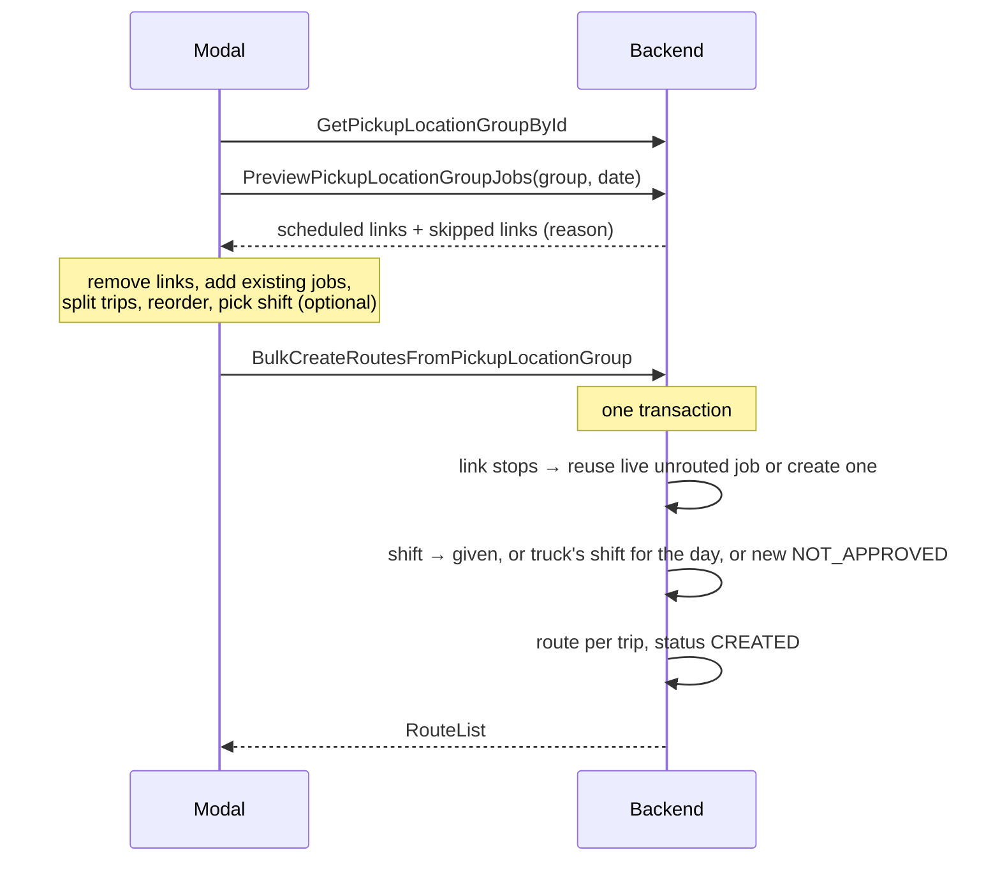

# Bulk route creation from a pickup location group

Proto for the «Создать маршрут из группы» modal (admin → Группы точек).
The modal becomes a **manual run of the daily generator** for one group and
one day, with a stop list the dispatcher can edit first.

## STAR

- **Situation** — the modal builds draft jobs on the client, then calls
  `CreateJob` once per link and `CreateRouteWithJobs` once per trip.
- **Task** — make it act like the daily generator (cron): jobs by schedule,
  shift found or created, route created — but editable before submit.
- **Action** — three API changes:
  1. `GetPickupLocationGroupById` returns everything the modal shows.
  2. New `PreviewPickupLocationGroupJobs` returns the links the generator
     would pick for the date.
  3. New `BulkCreateRoutesFromPickupLocationGroup` checks existing jobs,
     creates the missing ones, finds or creates the shift and creates the
     routes — in one transaction.
- **Result** — one read, one preview, one write. Same rules as the cron, no
  duplicates, no half-created state.

## Problems today

| Problem                                        | Effect                                                  |
| ---------------------------------------------- | ------------------------------------------------------- |
| 1 `CreateJob` per link + 1 route call per trip | Slow submit on big groups                               |
| Not atomic                                     | Failure on job 7 of 15 leaves 6 orphan jobs, no route   |
| No existence check                             | Duplicates jobs the cron already made, or on retry      |
| Client sends `service_receiver_id`, category   | Server trusts client-derived data                       |
| Client loads every pickup location of company  | Only to join coords, owner, contract onto the group     |
| Needs an existing shift                        | Cannot plan a day for a truck nobody is assigned to yet |

## Who decides what

| Step                                   | Owner    |
| -------------------------------------- | -------- |
| Which links are scheduled for the date | Backend  |
| Final stop list (remove, add jobs)     | Frontend |
| Trip split and stop order              | Frontend |
| Reuse existing job or create a new one | Backend  |
| Window, provider, receiver, tariff     | Backend  |
| Shift: given one or find/create        | Backend  |

## Flow



## 1. `GetPickupLocationGroupById` — enriched

- `container_groups[].owner_organization` and `.contract` are now set.
- New `pickup_locations` — distinct locations of the group (name, lat/lon,
  address), without nested container groups.
- On the group, not on `ContainerGroup`: `pickup_location.proto` already
  imports `container_group.proto`, the reverse would be a cycle.

## 2. `PreviewPickupLocationGroupJobs` — new, read-only

- `links` — what the cron would generate for the date, with the schedule
  window.
- `skipped_links` — the rest, each with an `ErrorMessage` reason (no schedule,
  schedule not covering the day, contract error). Lets the modal say why a
  location is missing.

## 3. `BulkCreateRoutesFromPickupLocationGroup` — new

Stop = `link` **or** `job_id`.

| Stop                         | Backend does                                              |
| ---------------------------- | --------------------------------------------------------- |
| `link`, no job for the day   | Creates it: schedule window (whole day if none), contract |
| `link`, live unrouted job    | Reuses that job                                           |
| `link`, job in another route | Fails: `ERROR_CODE_JOB_ALREADY_ASSIGNED`                  |
| `link` not in the group      | Fails: `ERROR_CODE_CONTAINER_GROUP_NOT_BOUND`             |
| `job_id`                     | Attaches any unrouted job of the organization             |

Shift:

1. `driver_on_shift_id` given → use it.
2. Else truck = `truck_id` or the group's default truck → its approved or
   active shift for the day → else its NOT_APPROVED placeholder → else a new
   NOT_APPROVED shift without a driver (same helper the cron uses).

Routes: one per trip, status `CREATED`. Source and destination default to the
truck's depot.

Example — no shift picked, one stop reused from the orders table:

```json
{
  "owner_organization_id": "12",
  "pickup_location_group_id": "40",
  "date": "2026-10-09T00:00:00+05:00",
  "trips": [
    {
      "destination_location_id": "7",
      "stops": [
        { "link": { "container_group_id": "501", "job_type": "JOB_TYPE_MSW" } },
        { "job_id": "88231" },
        { "link": { "container_group_id": "502", "job_type": "JOB_TYPE_MSW" } }
      ]
    }
  ]
}
```

## Differences from the cron

| Cron                      | Modal                                  |
| ------------------------- | -------------------------------------- |
| Every scheduled link      | Dispatcher's list                      |
| One route, depot to depot | Any trips, any depots                  |
| Route `NOT_APPROVED`      | Route `CREATED`                        |
| Group's default truck     | Picked shift, picked truck, or default |

## Not changed

- Legacy `CreateRouteFromPickupLocationGroup`. No client source calls it;
  removal is a separate PR.
- `CreateJob`, `CreateRouteWithJobs` — other screens keep using them.

## Review notes

- All changes are additive; no field renumbered or removed on `main`.
- `job_type` is `string` to match `ContainerGroupJobTypeLink.job_type`.
- `buf lint` flags the response names (`RouteList`,
  `PickupLocationGroupJobsPreview`); kept to match existing RPCs
  (`MoveJobsBetweenRoutes → RouteList`).
