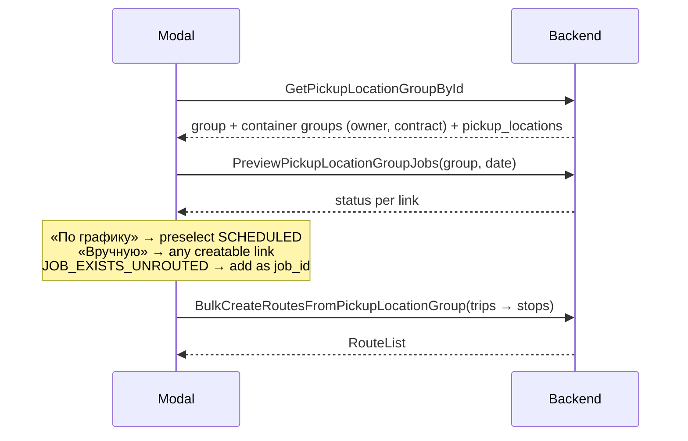

# Bulk route creation from a pickup location group

Proto for the «Создать маршрут из группы» modal (admin → Группы точек).

## STAR

- **Situation** — the modal builds draft jobs on the client, then calls `CreateJob` once per (container group, job type) link and `CreateRouteWithJobs` once per trip.
- **Task** — make the modal a real bulk-create tool: pick locations by hand or by schedule, without N+1 calls and broken half-states.
- **Action** — three API changes:
  1. `GetPickupLocationGroupById` returns everything the modal needs.
  2. New `PreviewPickupLocationGroupJobs` says, per link, what would happen on a given day.
  3. New `BulkCreateRoutesFromPickupLocationGroup` creates all jobs and routes in one transaction.
- **Result** — one read call, one preview call, one write call. Server owns schedule, contract and duplicate rules.

## Problems today

| Problem                                                   | Effect                                                                                            |
| --------------------------------------------------------- | ------------------------------------------------------------------------------------------------- |
| 1 `CreateJob` per link + 1 `CreateRouteWithJobs` per trip | Slow submit on big groups                                                                         |
| Not atomic                                                | Failure on job 7 of 15 leaves 6 orphan jobs, no route                                             |
| No duplicate check                                        | Second job per link when the daily generator (`auto_generate_time`) already made one, or on retry |
| Client sends `service_receiver_id`, `job_category`        | Server trusts client-derived data                                                                 |
| Client loads every pickup location of the company         | Only to join coords, owner and contract onto the group                                            |
| Schedule ignored                                          | Dispatcher cannot «take what's scheduled for this day»                                            |

## New flow



## 1. `GetPickupLocationGroupById` — enriched

- `container_groups[].owner_organization`, `container_groups[].contract` are now set.
- New `pickup_locations` — distinct locations of the group (name, lat/lon, address), without nested container groups.
- Why on the group, not `ContainerGroup.pickup_location`: `pickup_location.proto` already imports `container_group.proto`; the reverse would be an import cycle.
- `ListPickupLocationGroups` stays thin — it returns every group of the company.

## 2. `PreviewPickupLocationGroupJobs` — new

One entry per group link for `date`:

| Status                 | Meaning                                      | Modal                       |
| ---------------------- | -------------------------------------------- | --------------------------- |
| `SCHEDULED`            | Schedule covers the day, `tw_*` = its window | Preselected in «По графику» |
| `NOT_SCHEDULED_ON_DAY` | Schedule exists, not this day                | Selectable manually         |
| `NO_SCHEDULE`          | No schedule for this job type                | Selectable manually         |
| `CONTRACT_ISSUE`       | Contract forbids it, `reason` says why       | Disabled                    |
| `JOB_EXISTS_UNROUTED`  | Live job already exists, `existing_job_id`   | Added as `job_id` stop      |
| `JOB_EXISTS_ROUTED`    | Already in `existing_route_id`               | Disabled, links to route    |

Same classification the daily generator uses, so modal and cron agree.

## 3. `BulkCreateRoutesFromPickupLocationGroup` — new

- Request: shift, date, `trips[]`; each trip has a depot and ordered `stops[]`.
- Stop = `link` (create a job) **or** `job_id` (attach an existing unrouted job, e.g. one picked in the orders table).
- One transaction. Any failing stop rolls back everything.
- Server, per `link` stop:
  1. Link must belong to the group → else `ERROR_CODE_CONTAINER_GROUP_NOT_BOUND`.
  2. Live job already exists for the day → `ERROR_CODE_JOB_ALREADY_EXISTS_FOR_DAY` (new, args: `id`, `job_type`, `date`, `job`). Client swaps in `job_id`.
  3. Provider, receiver, tariff from the contract.
  4. Window from the schedule; whole day when the schedule does not cover it.
- Per trip: truck compatibility check, route category from the first stop.

Example:

```json
{
  "owner_organization_id": "12",
  "pickup_location_group_id": "40",
  "driver_on_shift_id": "9001",
  "date": "2026-10-08T00:00:00+05:00",
  "trips": [
    {
      "source_lon": 76.94,
      "source_lat": 43.25,
      "source_location_id": "3",
      "destination_location_id": "7",
      "stops": [
        { "link": { "container_group_id": "501", "job_type": "JOB_TYPE_MSW" } },
        { "job_id": "88231" },
        { "link": { "container_group_id": "502", "job_type": "JOB_TYPE_MSW" } }
      ]
    }
  ]
}
```

## Not changed

- Legacy `CreateRouteFromPickupLocationGroup` (routes the group's existing jobs onto the default truck). No client source calls it; removal is a separate PR.
- `CreateJob`, `CreateRouteWithJobs` — other screens keep using them.

## Review notes

- All changes are additive; no field renumbered or removed.
- `job_type` is `string` to match `ContainerGroupJobTypeLink.job_type`, so the client joins preview and links by the same key.
- `buf lint` flags the response names (`RouteList`, `PickupLocationGroupJobsPreview`); kept to match existing RPCs (`MoveJobsBetweenRoutes → RouteList`).
